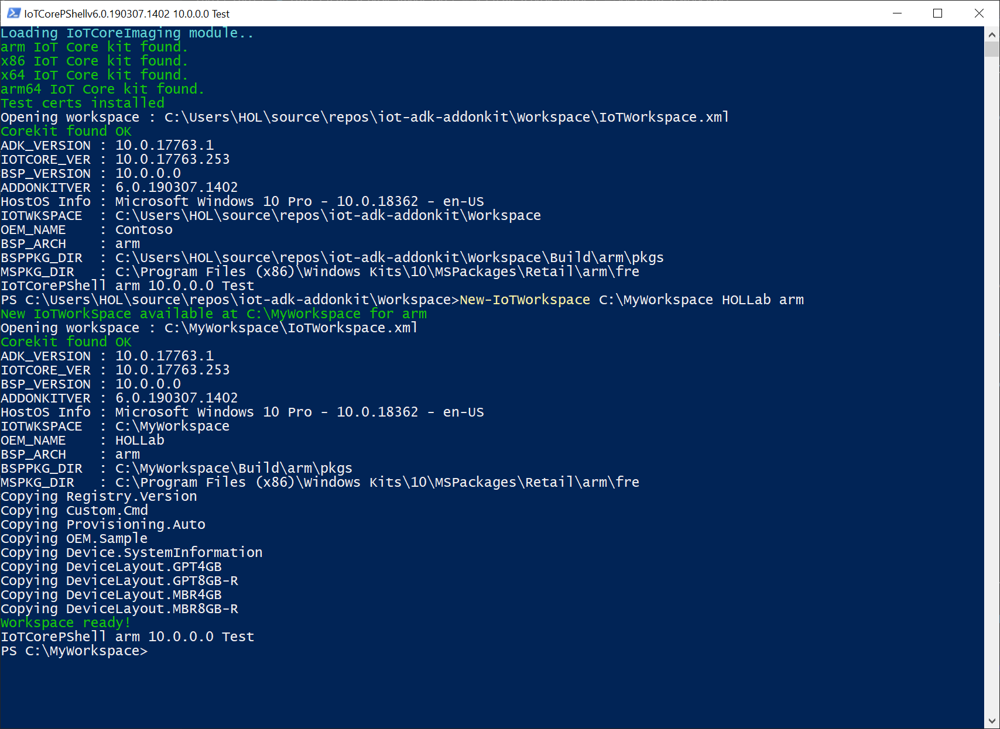
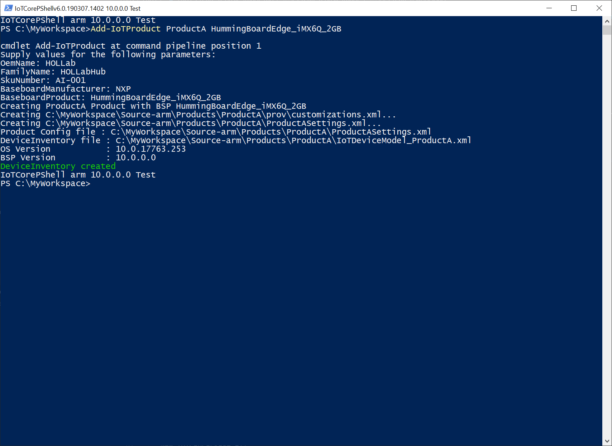

# Create a basic image

To get started, we'll create a basic Windows 10 IoT Core (IoT Core) image and flash it onto a specific hardware device.

We'll create a product folder that represents our first design. For our first product design, we'll customize just enough for the IoT core device to boot up and run the built-in OOBE app, which we should be able to see on an HDMI-compatible monitor.

To make running these commands easier, we'll install and use the IoT Core shell, which presets several frequently-used paths and variables.

> NOTE: You will need to have a number of tools installed on your machine when you do this outside of the lab. We've already installed those for you on the lab machines. Here is what we installed for this lab:
>- Windows Assessment and Deployment KiT (Windows ADK)
>- Windows 10 IoT Core packages
>- IoT Core ADK Add-Ons
>- IoT Core PowerShell environment
>- A text editor like Notepad or VS Code - We chose VS Code 

## Create a workspace

1. In Windows Explorer, go to the folder where you installed the IoT Core ADK Add-Ons, for example, `C:\IoT-ADK-AddonKit`, and open IoTCorePShell.cmd. It should prompt you to run as an administrator.

   This will load the PowerShell module and also check the versions of the ADK, IoT Core kit. This will also check for the test certificates in the certificate store and if not present, install them automatically.
   
   Troubleshooting: Error: "The system cannot find the path specified". If you get this, right-click the icon and modify the path in "Target" to the location you've chosen to install the tools.

2. In the IoTCorePShell, create a new workspace say C:\MyWorkspace with an OEM name HOLLab for the architecture arm using New-IoTWorkspace

   ```powershell
   New-IoTWorkspace C:\MyWorkspace HOLLab arm
   ```
   
   IoT Core supports four architectures, x64,x86,arm and arm64.
   
   Only alphanumeric characters are supported in the OEM name as this is used as a prefix for various generated file names.
   
   This generates the IoTWorkspace.xml and sets a version number for the design , which you can use for future updates. The first version number defaults to 10.0.0.0. 

   The required packages such as Registry.Version, Custom.Cmd and Provisioning.Auto will be imported into the workspace automatically.

   

2. Create a new link on the desktop to IoTCorePshell by sending a shortcut to the desktop for `C:\MyWorkspace\IoTCorePShell.cmd`

3. Re-open the IoT workspace to reset the variables (otherwise it will assume the existing directories)

   ```powershell
   Open-IoTWorkspace .\IoTWorkspace.xml
   ```

4. Import an existing BSP

   This next step is to take an existing Board Support Package files and extract and build their .CAB files to include in the FFU file. 
   
   Import the bsp using Import-IoTBSP:

   ```powershell
   Import-IoTBSP HummingBoardEdge_iMX6Q_2GB C:\HOLFirmware\imx-iotcore\BSP\
   ```

   >NOTE: For more information see [Window 10 IoT Core and NXP i.MX SoCs](https://docs.microsoft.com/windows/iot-core/learn-about-hardware/iotnxp) for information on the NXP BSP access and Ecosystem resources.

5. Create a test project

   From the IoT Core Shell Environment, create a new product folder that uses the MX6 BSP. This folder represents a new device we want to build, and contains sample customization files that we can use to start our project. 
   
   Create a new product using Add-IoTProduct:

   ```powershell
   Add-IoTProduct ProductA HummingBoardEdge_iMX6Q_2GB
   ```

   You will be prompted to enter the **SMBIOS** information such as Manufacturer name (OEM name), Family, SKU, BaseboardManufacturer and BaseboardProduct. Here are some example values:

   - **System OEM Name**: HOLLab
   - **System Family Name**: HOLLabHub
   - **System SKU Number**: AI-001
   - **Baseboard Manufacturer**: NXP
   - **Baseboard Product**: HummingBoardEdge_iMX6Q_2GB
     
   This creates the folder: `C:\MyWorkspace\Source-arm\Products\ProductA`.

   

6. Build the packages

   From the IoT Core Shell, get your environment ready to create products by building all of the packages in the working folders using New-IoTCabPackage:

   ```powershell
   New-IoTCabPackage All
   ```

   >NOTE: If you ever get SignTool errors when building the packages in Test mode, please run `installoemcerts.cmd` to install the test certificates on your machine.

7. Build the basic image

   This last step creates the basic image that can be deployed to the board. In the next few labs we'll add a driver to the BSP and configure it for a new board. We'll also add an application and then create a final image. For right now we're just going to build this basic image without any customizations to ensure that we're ready for the next labs.

   To build the image follow these steps:

   1. Eject any removable storage from the lab machine
   2. Build the FFU image file by entering the following command in the IoT Core PowerShell Environment using New-IoTFFUImage:
      
      ```powershell
      New-IoTFFUImage ProductA Test
      ```

      This builds an FFU file with your basic image at `C:\MyWorkspace\Build\arm\ProductA\Test`. This test image will include additional tools that can be used for debugging purposes. Building the final FFU file will take around 10 to 30 minutes to complete.
      
      To direct all output to console instead of log file, add `-Verbose` flag, such as the one below.

      ```powershell
      New-IoTFFUImage -Verbose ProductA Test
      ```

If this all worked without error then Lab 1 is now complete and you have created the basic image. If you wish to you can use the Windows IoT Dashboard to deploy this basic image to an SD card and test it on your iMX6 board.

## Next Lab

[Lab 2 - Bringing up a new board](/Labs/Lab2/Lab2_Bringing_up_a_new_board.md)