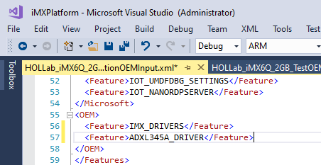

# Creating a new Board Support Package

In this lab we'll be creating a new Board Support Package (BSP) that includes the driver you built and debugged in labs 2 and 3. 

A BSP includes a set of device drivers that are specific to the components/silicon used in the board. These are provided by the component vendors / silicon vendors, mostly in the form of .inf and associated .sys/.dll files.

You should create a new Board Support Package (BSP) when:
- Creating a new hardware design
- Replacing a driver or component on an existing hardware design

Whether you're creating a new BSP or modifying an existing BSP, you become the owner. This lets you decide whether to allow updates to install on your boards.

## Update the VS Solution

1. In Visual Studio, edit `GenerateFFU.bat` in Build Scripts and comment out the HummingBoard build target using REM. This will speed up FFU generation time since it will only build the FFU for your board.

   

2. Unload `GenerateBSP` and edit the project.

   

3. Add the following to both `<NMakeBuildCommandLine>` and `<NMakeReBuildCommandLine>`

        call ..\..\..\tools\BuildBSP.bat iMX6 HOLLab_iMX6Q_2GB

   

4. Save the project and reload it.

## Add the driver project to the VS Solution

There are several ways that you can add driver support to your device (in the IoTPShell, VS Solution, Provisioning etc) but in this lab we'll be adding the driver to directly into the BSP project.

1. Copy the driver project, `C:\Users\HOL\source\repos\IoTHOL\Driver\ADXL345Acc` into the `C:\HOLFirmware\imx-iotcore\driver` folder.

2. Right click `Drivers` in the VS Solution Explorer and add `C:\HOLFirmware\imx-iotcore\driver\ADXL345Acc\ADXL345Acc.vcxproj`

3. Right click on the `HOLLab_iMX6Q_2GB` project and select `Build Dependencies`->`Project Dependencies`

4. Select `ADXL345Acc` and click OK.

## Add the driver to the BuildBSP batch file

1. Open `C:\HOLFirmware\imx-iotcore\build\tools\BuildBSP.bat` in Visual studio

2. Add the following to  after the line `echo Copying Driver Packages to %PKG_ROOT%`:

   ```
   mkdir %PKG_ROOT%\AXDL345 >NUL 2>NUL
   copy %BUILD_ROOT%\ADXL345Acc\* %PKG_ROOT%\AXDL345\ >NUL
   if errorlevel 1 (set FAILURE=AXDL345 & goto ERROR)
   copy %REPO_ROOT%\driver\ADXL345Acc\ADXL345Acc.wm.xml %PKG_ROOT%\AXDL345\ >NUL
   ```
   
   > Note: This is a short term workaround that is expected to be addressed later this year

   

## Add packages to the feature manifest

1. Using Visual Studio, open the feature manifest file for your new BSP, `C:\HOLFirmware\imx-iotcore\build\board\HOLLab_iMX6Q_2GB\InputFMs\HOLLab_iMX6Q_2GB_DeviceFM.xml`

2. Add the new driver for the accelerometer to the package directory and put the following entry into the OEM section of the XML:

   ```xml
   <PackageFile Path="%BSPPKG_DIR%" Name="HOL.Accel.ADXL345Acc.cab">
       <FeatureIDs>
       <FeatureID>ADXL345A_DRIVER</FeatureID>
       </FeatureIDs>
   </PackageFile>
   ```

   

3. Finally add the driver to the OEM manifests for your BSP (we'll be building a retail version later so we'll setup the retail driver now), `C:\HOLFirmware\imx-iotcore\build\board\HOLLab_iMX6Q_2GB\HOLLab_iMX6Q_2GB_TestOEMInput.xml` and `C:\HOLFirmware\imx-iotcore\build\board\HOLLab_iMX6Q_2GB\HOLLab_iMX6Q_2GB_ProductionOEMInput.xml` between the `<OEM></OEM>` tages:

   ```xml
        <Feature>ADXL345A_DRIVER</Feature>
   ```

   We're now done with adding the driver.

   

4. Ensure all the files are saved and rebuild the `GenerateBSP` project.

   

   >Note: SingTool.exe is sensitive to network timeouts. If it fails to sign a file then just rebuild the BSP again.

## Create a new product folder

1. Import the new BSP into your IoTPShell workspace (reopen it if you've closed it by clicking on the shortcut you created on the desktop)

   ```powershell
   Import-IoTBSP HOLLab_iMX6Q_2GB C:\HOLFirmware\imx-iotcore\BSP\
   ```

2. Ensure all the packages are built

   ```powershell
   New-IoTCabPackage all
   ```

3. Create a new product using Add-IoTProduct and the newly imported BSP:

   ```powershell
   Add-IoTProduct ProductB HOLLab_iMX6Q_2GB
   ```

You will be prompted to enter the **SMBIOS** information such as Manufacturer name (OEM name), Family, SKU, BaseboardManufacturer and BaseboardProduct (*Note the change in Baseboard Product*):

- **System OEM Name**: HOLLab
- **System Family Name**: HOLLabHub
- **System SKU Number**: AI-001
- **Baseboard Manufacturer**: NXP
- **Baseboard Product**: HOLLab_iMX6Q_2GB
  
This creates the folder: `C:\MyWorkspace\Source-arm\Products\ProductB`.

## Build and test the image

1. Now let's build the image. From the IoT Core Shell, create the image:

   ```powershell
   buildimage ProductB Test -Verbose
   ```

   This creates the product binaries at `C:\MyWorkspace\Build\arm\ProductB\Test\Flash.ffu`.

2. Start **Windows IoT Core Dashboard > Setup a new device > NXP**.

   

3. Enter the file and path name from above.

   

4. Put the Micro SD card in the device, select it, give your device a name (e.g. Lab3), enter an Administrator password, accept the license terms, and click **Install**. This replaces the previous image with our new image.

   

5. **Deploy** the `firmware_fit.merged` and `uefi.fit` to the card.

   > Note: You can add your final firmware and uefi files to the BSP so they'll be automatically included however it is recommended that while in BSP development it is easier to just manually copy these files rather than try to include them in BSP Project automation.
   
6. Put the card into the IoT device and start it up. After a short while, the device should start automatically, and you should see the OOBE start.

7. When OOBE is finished your device will show up in the Dashboard under the name you gave it in Step 3.

   

8. Check to see that your driver is working. Use the testing procedures in the Lab 2 to test your driver. When you inspect the device you should see something like this:

   

   >Note: The status code may vary but you should not see a Problem code. If you see Problem Code 10 then Windows is saying that it could not find the device. Please ensure that the sensor wiring is correct and reboot the device.

   >Note: If you see Problem Code 28 then Windows can't find the driver. Ensure that you have added the driver to the manifests and modified the BuildBSP.bat file to copy the driver correctly.
   
## Next Lab

[Lab 4 - Adding an application to your image](/Labs/Lab4/Lab4_Adding_an_app_to_your_image.md)

## Previous Lab

[Lab 2 - Bringing up a new board](/Labs/Lab2/Lab2_Bringing_up_a_new_board.md)