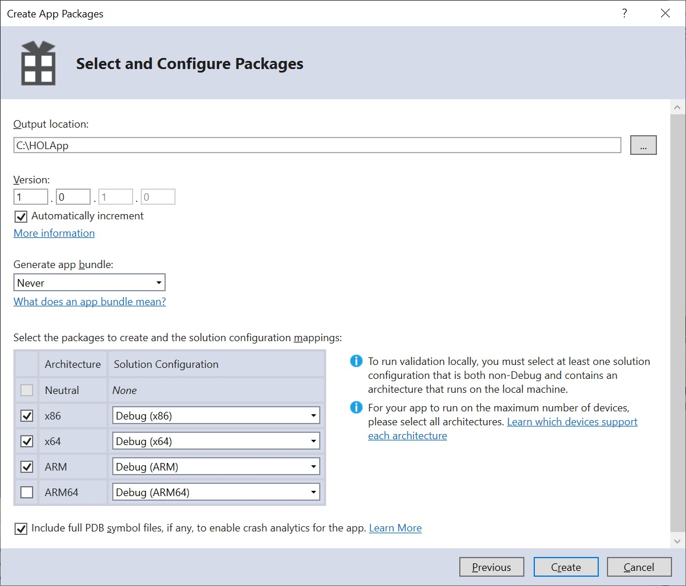

# Adding an application to your image

We are now going to take an app (in this case a modified version of the IoT Core Default app), package it up, and create a new Windows IoT Core image you can load onto your device.

## Supported Application Types

### Universal Windows Platform (UWP) Apps
IoT Core is a UWP centric OS and UWP apps are its primary app type.

Universal Windows Platform (UWP) is a common app platform across all version of Windows 10, including Windows 10 IoT Core. UWP is an evolution of Windows Runtime (WinRT). You can find more information and an overview to UWP [here](https://docs.microsoft.com/windows/uwp/get-started/universal-application-platform-guide).

### Traditional UWP Apps
UWP apps just work on IoT Core, just as they do on other Windows 10 editions. A simple, blank Xaml app in Visual Studio will properly deploy to your IoT Core device just as it would on a phone or Windows 10 PC. All of the standard UWP languages and project templates are fully supported on IoT Core.

There are a few additions to the traditional UWP app-model to support IoT scenarios and any UWP app that takes advantage of them will need the corresponding information added to their manifest. In particular the "iot" namespace needs to be added to the manifest of these standard UWP apps.

Inside the attribute of the manifest, you need to define the iot xmlns and add it to the IgnorableNamespaces list. The final xml should look like this:

```xml
<Package
  xmlns="http://schemas.microsoft.com/appx/manifest/foundation/windows10"
  xmlns:mp="http://schemas.microsoft.com/appx/2014/phone/manifest"
  xmlns:uap="http://schemas.microsoft.com/appx/manifest/uap/windows10"
  xmlns:iot="http://schemas.microsoft.com/appx/manifest/iot/windows10"
  IgnorableNamespaces="uap mp iot">
```

### Background Apps

In addition to the traditional UI apps, IoT Core has added a new UWP app type called "Background Applications". These applications do not have a UI component, but instead have a class that implements the "IBackgroundTask" interface. They then register that class as a "StartupTask" to run at system boot. Since they are still UWP apps, they have access to the same set of APIs and are supported from the same language. The only difference is that there is no UI entry point.

Each type of IBackgroundTask gets its own resource policy. This is usually restrictive to improve battery life and machine resources on devices where these background apps are secondary components of foreground UI apps. On IoT devices, Background Apps are often the primary function of the device and so these StartupTasks get a resource policy that mirrors foreground UI apps on other devices.

You can find in-depth information on Background apps on [MSDN](https://docs.microsoft.com/windows/iot-core/develop-your-app/backgroundapplications).

### Non-UWP (Win32) Apps
IoT Core supports certain traditional Win32 app types such as Win32 Console Apps and NT Services. These apps are built and run the same way as on Windows 10 Desktop. Additionally, there is an IoT Core C++ Console project template to make it easy to build such apps using Visual Studio.

There are two main limitations on these non-UWP applications:

1. No legacy Win32 UI support: IoT Core does not contain APIs to create classic (HWND) Windows. Legacy methods such as CreateWindow() and CreateWindowEx() or any other methods that deal with Windows handles (HWNDs) are not available. Subsequently, frameworks that depend on such APIs including MFC, Windows Forms and WPF, are not supported on IoT Core.

2. C++ Apps Only: Currently, only C++ is supported for developing Win32 apps on IoT Core.

### App Service
App services are UWP apps that provide services to other UWP apps. They are analogous to web services, on a device. An app service runs as a background task in the host app and can provide its service to other apps. For example, an app service might provide a bar code scanner service that other apps could use. App services let you create UI-less services that apps can call on the same device, and starting with Windows 10, version 1607, on remote devices. Starting in Windows 10, version 1607, you can create app services that run in the same process as the host app.

Additional information regarding creating a background app service as well as consuming the service from a uwp apps (as well as background tasks/services) can be found [here](https://docs.microsoft.com/en-us/windows/uwp/launch-resume/how-to-create-and-consume-an-app-service).

## Create an appx package

The first step is to create a Universal Windows Platform (UWP) application that will run on the IoT device.

1. Launch Visual Studio and then select File->Open Project/Solution. Choose `C:\Users\HOL\source\repos\IoTHOL\Apps\AcceleromterDemo\AcceleromterDemo.sln`. This is a small demo app that shows 2 dimensional axial data from the ADXL345.

2. In Visual Studio create an Appx package. This is done by clicking **Project > Store > Create App Packages > I want to Create Packages for Sideloading > Next**

3. Select **Output location** as `C:\HOLApp` (or any other path that doesn't include spaces.)

4. Select **Generate app bundle**: Never

5. Click **Create**.

   

   >Visual Studio creates the Appx files in your specifed location for the architecture(s) you selected (ARM, x86, x64). In our example, this file is: `C:\HOLApp\AcceleromterDemo_1.0.0.0_ARM_Debug_Test`

## Create a new product

We can build the complete firmware and OS images in the imx-iotcore file structure either from the command line or in WSL but decoupling the creation of the device FFU and the firmware development allows parallel workstreams between the SoC/Board engineers and the overall device engineers. Let's create a new product to add our application into. This is the functionally the same as the steps at the end of Lab 3.

1. Open the IoT PShell.

2. Create a new product using Add-IoTProduct and the newly imported BSP:

```powershell
Add-IoTProduct ProductC HOLLab_iMX6Q_2GB
```

You will be prompted to enter the **SMBIOS** information such as Manufacturer name (OEM name), Family, SKU, BaseboardManufacturer and BaseboardProduct (*Note the change in Baseboard Product*):

- **System OEM Name**: HOLLab
- **System Family Name**: HOLLabHub
- **System SKU Number**: AI-001
- **Baseboard Manufacturer**: NXP
- **Baseboard Product**: HOLLab_iMX6Q_2GB
  
This creates the folder: `C:\MyWorkspace\Source-arm\Products\ProductC`.

## Package the Appx

The next step is to package the Appx file, which will allow you to customize it and build it using the Windows ADK (when you build the FFU image).

1. Create the package for your Appx by using `New-IoTAppxPackage`. Replace the file path location and package name with your Appx package. For this lab, the command is as follows:

   ```powershell
   Add-IoTAppxPackage "C:\HOLApp\AcceleromterDemo_1.0.0.0_ARM_Debug_Test\AcceleromterDemo_1.0.0.0_ARM_Debug.appx" fga Appx.AccelDemo
   ```

  > Note: The directory above assumes this is the first time you've built the packages. If the version number doesn't match then replace the folder with the one from the most recent package generation.

   >The fga parameter indicates the Appx file is a foreground application. If you specify your package as a background application (with the bga parameter) and have no other foreground applications in the image, the system will get stuck when booting up (displays a spinner indefinitely).

   This creates a new folder at `C:\MyWorkspace\Source-arm\Packages\Appx.AccelDemo`, copies the appx files and its dependencies and generates a `customizations.xml` file as well as a package xml file that is used to build the package.

   Be aware that if your Appx has dependencies you will need the Dependencies subdirectory to be present in the same location as your Appx when you run this command. Failure to include this will result in errors when you build your FFU image.
   
   This also adds a FeatureID APPX_ACCELDEMO to the `C:\MyWorkspace\Source-arm\Packages\OEMFM.xml` file.

2. From the IoT Core Shell Environment, you can now build the package into a .CAB fileusing `New-IoTCabPackage`.

   ```powershell
   New-IoTCabPackage Appx.AccelDemo
   ```

   This will build the package into a .CAB file under `C:\MyWorkspace\Build\arm\pkgs\HOLLab.Appx.AccelDemo.cab`.

## Update the project's configuration files

You can now update your project configuration files to include your app in the FFU image biuld.

1. Add the FeatureID for our app package using `Add-IoTProductFeature`:

   ```powershell
   Add-IoTProductFeature ProductC Test APPX_ACCELDEMO -OEM
   ```

2. To make your app the default one we will need to remove the existing default app

   ```powershell
   Remove-IoTProductFeature ProductC Test IOT_BERTHA
   ```

## Build the image
From the IoT Core PowerShell Environment, get your environment ready to create products by building all of the packages in the working folders (using `New-IoTCabPackage`):

```powershell
New-IoTCabPackage All
```

Build the FFU image again, as specified in Lab 1: Create a basic image. You can use this command:

```powershell
New-IoTFFUImage ProductC Test -Verbose
```

Now that the image has been rebuilt without errors we're ready to bring everything together and deploy the image to the device. Remember to deploy the `firmware_fit.merged` and `uefi.fit` files as well.

## Updating the app

The accelerometer is oriented so that when the header is down the app should display the red down arrow. As you twist the sensor left and right you will see the other arrows start to show. One thing you might notice is that the app is very sensitive to gravity so that it only takes a little twist to turn arrows red. Let's fix this:

1. Go back to the AccelerometerDemo.sln in Visual Studio.

2. Open the `MainPage.xaml.cs` file in the solution explorer (if it isn't already expanded just click on the small triangle to the left of `MainPage.xaml`) double clicking  the displayed file.

3. Scroll down to the DisplayCurrentReadingAsync method and change the 0.1 & -0.1 values in that method to 0.5 & -0.5 respectively.

4. Save your project in **Visual Studio** and then build your Appx package. 

5. Once the Appx file is built, run the following command in **IoT Core Powershell Environment** ():

   ```powersheall
   Add-IoTAppxPackage "C:\HOLApp\AcceleromterDemo_1.0.1.0_ARM_Test\AcceleromterDemo_1.0.1.0_ARM.appx" fga Appx.AccelDemo
   ```

   >NOTE: There will be an error displayed - `Error: %OEM_NAME%.Appx.AccelDemo.cab already defined in FM file` - You can safely ignore this.

## Rebuild the image
From the IoT Core PowerShell Environment, get your environment ready to create products by building all of the packages in the working folders (using `New-IoTCabPackage`):

```powershell
New-IoTCabPackage All
```

Build the FFU image again, as specified in Lab 1: Create a basic image. You can use this command:

```powershell
New-IoTFFUImage ProductC Test -Verbose
```

Ddeploy the image to the SD Card and reboot the device. Remember to deploy the `firmware_fit.merged` and `uefi.fit` files as well. You'll now notice that the sensor requires more twisting to register a red arrow=.

## Next Lab

[Lab 5 - Bringing it all together](/Labs/Lab5/Lab5_Bringing_it_all_together.md)

## Previous Lab

[Lab 3 - Creating a new Board Support Package](/Labs/Lab3/Lab3_Creating_a_new_BSP.md)