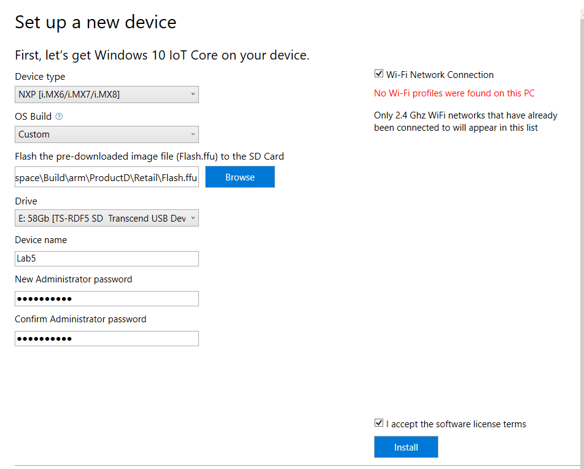

# Bringing it all together

We've created a new driver, built a new BSP using it and added an application to our image. We're now ready to deploy our test image to the board and ensure that everythiong works.

## Integrate your firmware

As this is the **final** BSP that you're building you would now integrate the firmware rather than deploying it manually to the SD Card for development (as we have been doing). 

1. Copy the firmware files into the BSP folders:

   ```
   cp /mnt/c/HOLFirmware/imx-iotcore/build/firmware/HOLLab_iMX6Q_2GB/firmware_fit.merged /mnt/c/HOLFirmware/imx-iotcore/build/board/HOLLab_iMX6Q_2GB/Package/BootLoader/
   
   cp /mnt/c/HOLFirmware/imx-iotcore/build/firmware/HOLLab_iMX6Q_2GB/uefi.fit /mnt/c/HOLFirmware/imx-iotcore/build/board/HOLLab_iMX6Q_2GB/Package/BootFirmware/
   ```

2. Switch to Visual Studio with the iMXPlatform.sln open and rebuild the BSP by right clicking on GenerateBSP and selecting Rebuild.

## Replace a few driver files

In the Retail signed case certain drivers need to be signed by Microsoft due to the tight nature between the HAL and these drivers during the Windows boot process. When working on your own BSP, if you have HAL extensions (or other drivers) that require this then please contact Microsoft.

1. From the Ubuntu shell copy these drivers to these locations:

   ```
   cp /mnt/c/Users/HOL/source/repos/IoTHOL/Labs/Lab5/imx6_drivers/HalExtiMX6Timers.dll /mnt/c/HOLFirmware/imx-iotcore/BSP/HOLLab_iMX6Q_2GB/Packages/HalExtTimers/

   cp /mnt/c/Users/HOL/source/repos/IoTHOL/Labs/Lab5/imx6_drivers/HalExtiMXDma.dll /mnt/c/HOLFirmware/imx-iotcore/BSP/HOLLab_iMX6Q_2GB/Packages/HalExtDma/

   cp /mnt/c/Users/HOL/source/repos/IoTHOL/Labs/Lab5/imx6_drivers/mx6pep.sys /mnt/c/HOLFirmware/imx-iotcore/BSP/HOLLab_iMX6Q_2GB/Packages/Power/
   ```

At this point you have a BSP that could be published. However you should note that some of the drivers in this BSP are still test signed. If you were really planning to release this you would go into the Visual Studio project and change the driver signing settings. You'd also update the signing for the firmware images. This way the public BSP will be completely retail signed.

## Update the BSP

1. Open `File Explorer` 

2. Change to the `C:\MyWorkspace\Source-arm\BSP` directory.

3. Delete the `HOLLab_iMX6Q_2GB` folder.

   

4. Switch to the IoTPShell and import the BSPagain:

   ```powershell
   Import-IoTBSP HOLLab_iMX6Q_2GB C:\HOLFirmware\imx-iotcore\BSP\
   ```

## Create a new product

We can build the complete firmware and OS images in the imx-iotcore file structure either from the command line or in WSL but decoupling the creation of the device FFU and the firmware development allows parallel workstreams between the SoC/Board engineers and the overall device engineers. Let's create a new product to add our application into. This is the functionally the same as the steps at the end of Lab 3.

1. Open the IoT PShell.

2. Create a new product using Add-IoTProduct and the newly imported BSP:

```powershell
Add-IoTProduct ProductD HOLLab_iMX6Q_2GB
```

You will be prompted to enter the **SMBIOS** information such as Manufacturer name (OEM name), Family, SKU, BaseboardManufacturer and BaseboardProduct (*Note the change in Baseboard Product*):

- **System OEM Name**: HOLLab
- **System Family Name**: HOLLabHub
- **System SKU Number**: AI-001
- **Baseboard Manufacturer**: NXP
- **Baseboard Product**: HOLLab_iMX6Q_2GB
  
This creates the folder: `C:\MyWorkspace\Source-arm\Products\ProductD`.

## Building a retail image

We're happy with our debug image now so the next step is to create a retailimage that we can post publicly. If you still have errors from creating thedebug image those will need to be correct first.

>Note: In addition to the development and deployment tools installed on your machine you will also need the following to enable retail signing:
>
 >- A retail code-signing certificate
 >- A cross-signing certificate
 > 
 >We've already installed these for you but you'll need to ensure that you acquire your appropriate certificates for work outside this HOL.

### Properly signing and including your applications

If you have one or more custom applications that you want to include in your Windows IoT Core retail image, you need to verify that these applications are signed properly when including them in your retail image. Follow these steps for each application you want to include in your image. Please note that you can skip Steps 8 and 9 if you only have one application to include.

1. Open the AccelerometerDemo solution in **Visual Studio** and open the `Package.appxmanifest` file.

3. Click on the **Packaging** tab and click on the **Choose Certificate...** button.

   

4. The dialog displayed will show what certificate is being used for code-signing. Click on the **Configure Certificate...** dropdown and select **Pick from certificate store...**:

   

5. Choose your retail code-signing certificate when prompted and click **OK**.

   

6. Save your project in **Visual Studio** and then build your Appx package. 

7. Once the Appx file is built, run the following command in **IoT Core Powershell Environment** ():

   ```powersheall
   Add-IoTAppxPackage "C:\HOLApp\AcceleromterDemo_1.0.2.0_ARM_Debug_Test\AcceleromterDemo_1.0.2.0_ARM_Debug.appx" fga Appx.AccelDemo
   ```
   >NOTE: There will be an error displayed - `Error: %OEM_NAME%.Appx.AccelDemo.cab already defined in FM file` - You can safely ignore this.

### Modify project configuration files

Follow the steps below to add any custom applications or provisioning packages you want to add to the retail image.

1. To add the new Default application, you should follow the instructions listed in Lab 5. However, you would specify `Retail` instead of `Test` when executing the `Add-IoTProductFeature` command, as shown here:

   ```powershell
   Add-IoTProductFeature ProductD Retail APPX_ACCELDEMO -OEM
   ```

   This adds a FeatureID called APPX_ACCELDEMO to the specified product's Retail OEMInput XML file.

2. To make your app the default one we will need to remove the existing default app

   ```powershell
   Remove-IoTProductFeature ProductD Retail IOT_BERTHA
   ```

### Build the retail image files
Once we have all the custom application packages signed properly, we can now build the Windows IoT Core retail image. Please verify that you have the retail code-signing certificate installed on your PC prior to following these steps:

1. Set the IoT signature to include details about your certificate and cross-certificate. This is done by modifying the `IoTWorkspace.xml` file, located in your workspace (e.g. `C:\MyWorkspace`). Open the file in Visual Studio and replace the existing `<RetailSignToolParam />` with:

   ```xml
   <!--Specify the retail signing certificate details, Format given below -->
    <RetailSignToolParam>/s my /sha1 "c100d6ed8592c63c712d1caef397407e8444ea3e" /fd SHA256 /ac "C:\Users\HOL\source\repos\IoTHOL\Labs\Lab5\DigiCert High Assurance EV Root CA.crt"</RetailSignToolParam>
   ```

   

2. Save the XML file.

3. Reopen the workspace:

    ```xml
    Open-IoTWorkspace .\IoTWorkspace.xml
    ```

4. Run **IoT Core PowerShell Environment** as an administrator.

5. Set the environment for retail signing. this is done with `Set-IoTRetailSign`:

   ```powershell
   Set-IoTRetailSign On
   ```

6. Build the packages

   ```powershell
   New-IoTCabPackage All
   ```

7. Build yoru retail image by running the following command:

   ```powershell
   New-IoTFFUImage ProductD Retail -Verbose
   ```

## Flash a Windows IoT Core image

The MX6 board uses the **Windows IoT Core Dashboard** to deploy the FFU (you can use DISM but this is the preferred way for development as it sets up the administrator account and machine name). Other boards and SoC's may use custom tools or the Deployment Imaging and Servicing and management (DICM) tool. The decision as to which tool to use will generally derive from the the board specific implementation.

1. Start the **Windows IoT Core Dashboard**.

2. Plug your micro SD card into your PC, and select it in the tool.

3. From the **Setup a new device** section, select **NXP** under **Device Type**.

4. Select **Custom** under OS Build.

5. Click **Browse** and navigate and select the FFU file you created earlier. In this case, your FFU file is located at `C:\MyWorkspace\Build\arm\ProductD\Retail\Flash.ffu`. Then click **Next**.

6. Verify that your microSD card is listed under the Drive selection.

7. Set the **Device Name** and **Administrator Password** selections for your device.

8. Check the **I accept the software license terms** checkbox (lower right) and click **Install**.

   

   Windows IoT Core Dashboard will now open a command window and use DISM (Deployment Image Servicing and Management Tool) to flash the FFU file to your microSD card.

   Once the flashing process is complete, eject the microSD card from your PC and insert it into the MX6. Reconnect the power to boot Windows IoT Core. You should see the IoT Core Default app, which shows basic information about the image and displays the sensor data.

9. Once the flashing is complete, **deploy the firmware** to the SD Card as you have done previously.

10. Place the card into the board and boot the machine to see it running the retail image.

## Previous Lab

[Lab 4 - Adding an application to your image](/Labs/Lab4/Lab4_Adding_an_app_to_your_image.md)